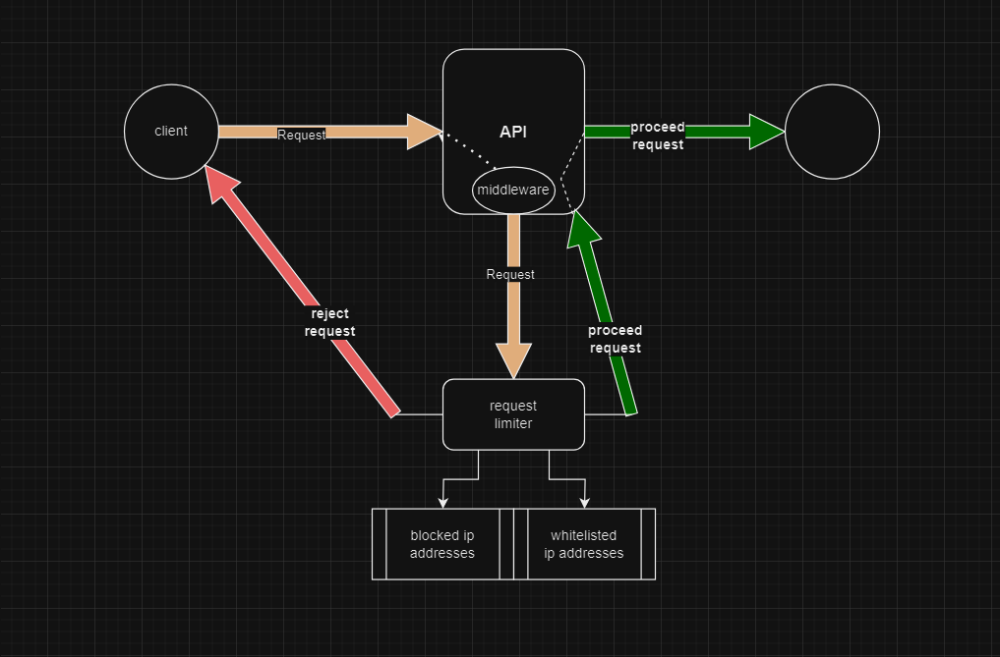

# FastAPI Request Limiter Middleware

This middleware provides request limiting functionality for FastAPI applications, allowing you to control and manage the rate of incoming requests based on client IP addresses.

## Installation

```bash
pip install fastapi-request-limiter
```

## Features

- **Request Limiting**: Control the rate of incoming requests by applying a waiting penalty to clients who exceed predefined thresholds.
- **Whitelisting**: Allow certain IP addresses to bypass rate limiting restrictions.
- **Blacklisting**: Disallow certain IP addresses to access the API on web-server level.
- **Flexible Configuration**: Customize the middleware behavior by specifying parameters such as waiting time, whether to limit HTTP or WebSocket requests, and whitelisted IP addresses.
- **Backups**: Allows to generate and load backups of request histories.

## Usage Example

```python
from fastapi import FastAPI
from request_limiter_middleware import RequestLimitMiddleware
from request_limiter_middleware import Backup, BanHammer

app = FastAPI()

# blocking address
BanHammer.block_it(ip="127.0.0.2")

# saving current IP requests history
Backup.save_archive('file.json')

# Enabling request limiting
app.add_middleware(RequestLimitMiddleware, whitelisted_ip_addresses=("127.0.0.1",),
                   limit_http=True, limit_websocket=True, seconds=7)
# loading history backup
Backup.load_archive('file.json')


@app.get(path='/')
async def home():
  return {"message": "Welcome home"}
```

This example demonstrates how to integrate and use the middleware in your FastAPI application. 

It includes blocking a specific IP address, saving the current IP requests history to a file, enabling request limiting with specified configurations, and loading the history backup from the file.

### Parameters

- `app`: The FastAPI application instance.
- `whitelisted_ip_addresses`: Tuple of whitelisted IP addresses that will bypass rate limiting.
- `seconds`: Time interval between two requests in seconds (default: 5 seconds).
- `limit_http`: Boolean flag to enable/disable request limiting for HTTP requests (default: True).
- `limit_websocket`: Boolean flag to enable/disable request limiting for WebSocket connections (default: True).


# Detailed

---
### Scheme:


---
## FastAPI Request Limiter Middleware contains of three parts:

### Requests Archive
    
`RequestsArchive` is a singleton class containing a `history` dictionary with history of requests, which are  in according to following structure:

```
{
    'ip': {
        "expiration_time": float | bool
    },
}
```

- `waiting_time` is the number of seconds to wait
- `expiration_time` is the remaining seconds `time.time() + seconds` or `False` if the IP is blocked.


`RequestsArchive` has three methods:
- `extend_time` : Extends the cooldown of the given ip for `N` seconds, by default it's 5.
- `get_remaining_time` : Converts the remaining cooldown in `float` (`expiration_time`'s value) to `int` and returns it.
  - If a `bool` value found, which means the IP is permanently blocked, it raises `HTTPException` with `400` status_code and `"Goodbye"` detail. 
- `add_ip` :Adds the given ip to history with `N` seconds of cooldown, by default it's 5. Used for unknown IP addresses requesting the API for the first time.

---
### BanHammer and Backup

`BanHammer` and `Backup`, both are derived classes from Requests Archive.


- #### BanHammer

`BanHammer` allows to block the user permanently. It has one method `block_it` which changes the `"expiration_time"` for the particular IP from `float` to `False`.
This allows to raise errors in case of finding `bool` value instead of `float` without further proceeding.

`BanHammer` as well as the entire library doesn't have any _unblocking_ mechanisms, which is an essential nuance in request limiting and managing the security of the API.

As `RequestsArchive` is a singleton class, you block IP addresses before and during runtime from any part of your code using `BanHammer`.

BTW: this mechanism perfectly matches with my another original library called [input-armor](https://github.com/Armen-Jean-Andreasian/Input-Armor) where you can check user input for maliciousness.  

- #### Backup

`Backup` provides `save_archive` and `load_archive` methods. 
As well as `BanHammer` this class can be used any time from any part of the code.

---
#### RequestLimitMiddleware

If you want to find an instantiation example of `RequestLimitMiddleware` as well as with its parameters and their explanations: Look at **Usage Example** section of this document to find.

First of all, `RequestLimitMiddleware` checks the incoming request type, whether it's `http` or `websocket` and if the request should or should not be request limited, and proceeds the request if it should not.
Then it obtains the client IP using `Request(scope).client.host`. 
    - Addition: If you are using `Flask` or `Django` you need to modify the way of invoking the IP address. As that's the only `FastAPI`-related dependency of this library. However, instead of installing with `pip` you need to clone this repo. 
In the next step it checks if the IP is white-listed, and proceeds the request if it is. 
Then it checks for the active waiting penalty, if yes raises an error with `429` status code.

---

## License

This project is licensed under the terms of the [BSD license](LICENCE.rst).

---

## Author

- [Armen-Jean Andreasian](https://github.com/Armen-Jean-Andreasian/)

-- -

### Links:
- [GitHub Repository](https://github.com/Armen-Jean-Andreasian/fastapi-request-limiter.git)
- [PyPI Package](https://pypi.org/project/fastapi-request-limiter/)

---